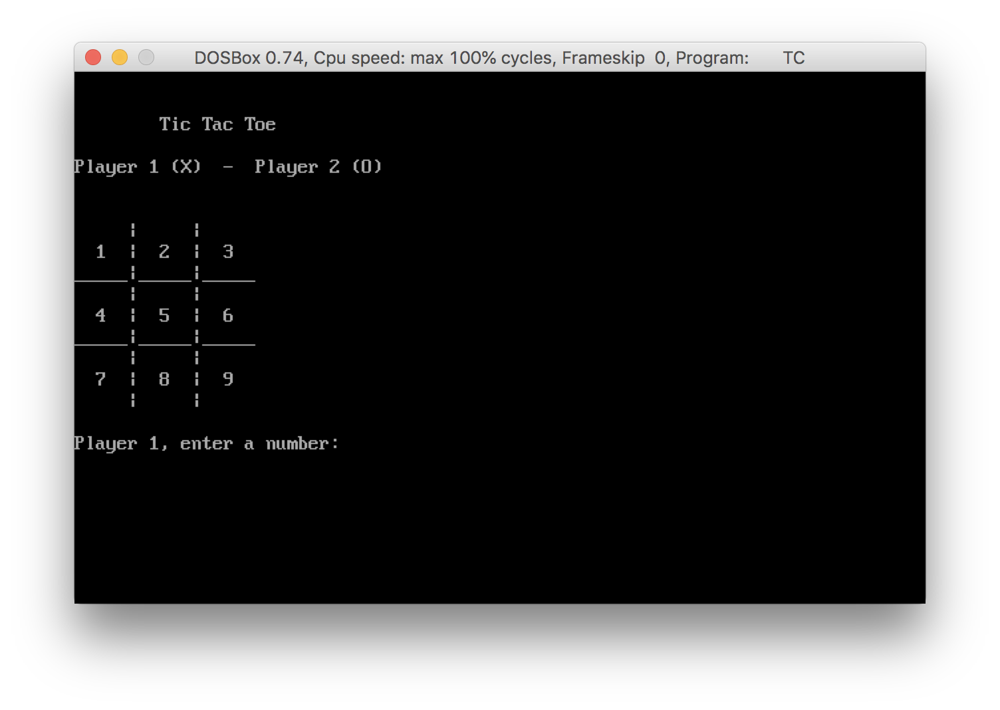
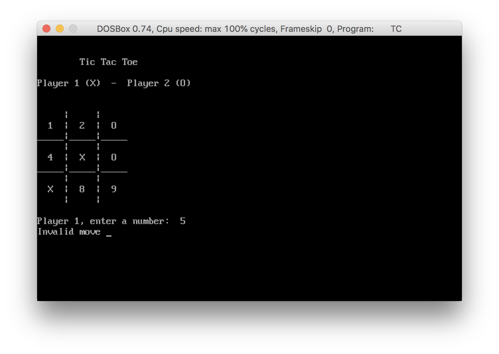
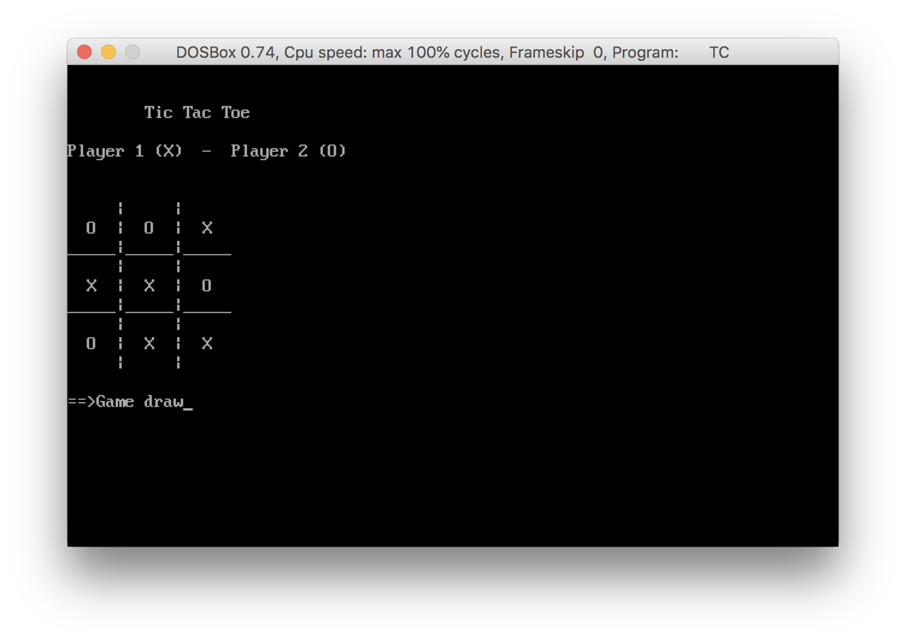
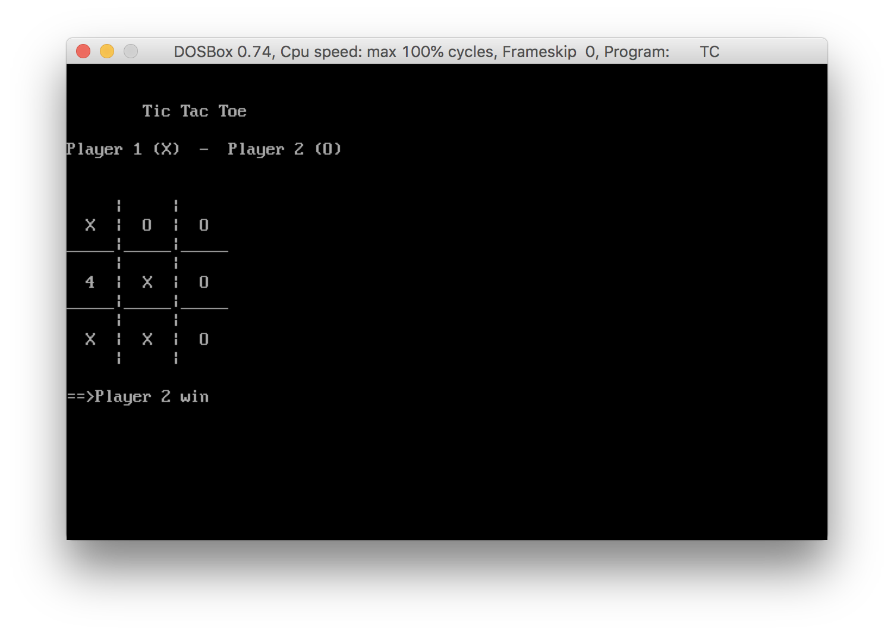

# :o: TicTacToe :x:

TicTacToe (also known as noughts and crosses or Xs and Os) is a paper-and-pencil game for two players, X and O, who take turns marking the spaces in a 3×3 grid. The player who succeeds in placing three of their marks in a horizontal, vertical, or diagonal row wins the game.1

*This program is tested using Borland C++ Compiler.*

## File Structure
| File Name | Description |
| --- | --- |
| TICTACTOE.CPP | main application |

## Screenshots
> Start Screen

> Invalid Move

> Game Over

> Winner Screen

Keep playing :video_game: :space_invader:

### Reference
1. [Tic-tac-toe (From Wikipedia, the free encyclopedia)](https://en.wikipedia.org/wiki/Tic-tac-toe)